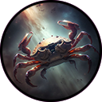
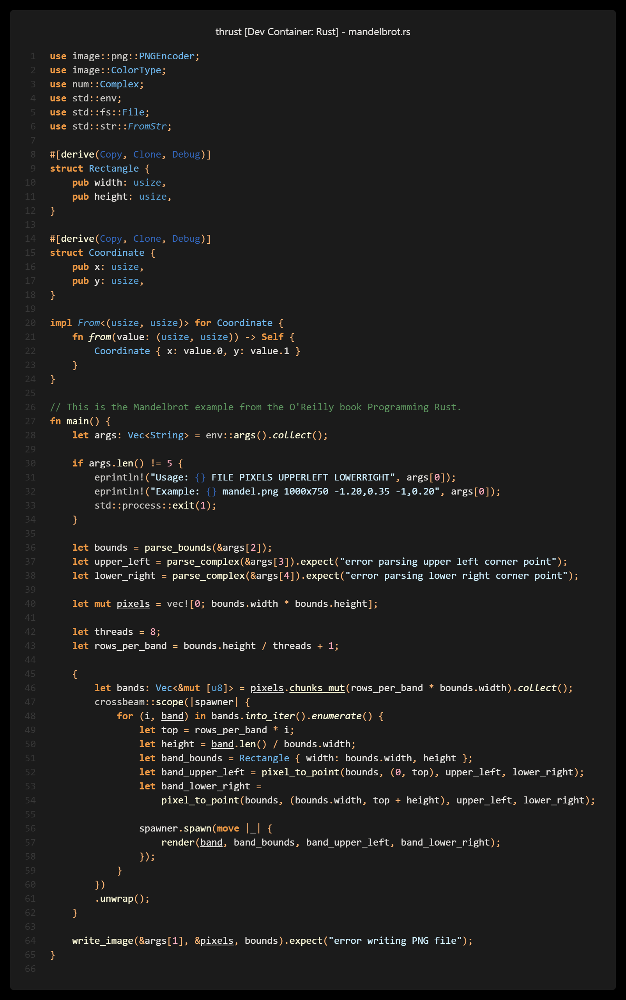

# Thrust, a theme for Rust.

A simple, clear VSCode theme with minimal distractions and tasteful orange accents (other colors are available).

Why "a theme for Rust"? 
I was writing Rust at the time, and read [this](https://rauljordan.com/rust-concepts-i-wish-i-learned-earlier/) blog post by Raul Jordan. 
The theme used in his code samples had orange accents for the keywords and operators, and I thought that worked really well.
I tried to find a similar existing theme I could use in VSCode, but failed.
So I decided to make one, and this is the result.

## Code Origins

The starting point for this repo was the [Pale Fire](https://github.com/matklad/pale-fire) repo by Alex Kladov.
I then customised it to create the workflow I wanted, and started playing with the colors.

Like Pale Fire, this repo uses the [Mottle](https://github.com/arzg/mottle) crate by Luna Razzaghipour to build the theme files.

## Theme Accent Colors

In addition to Thrust Orange, I created Red, Yellow and Green versions of the theme. 
This was mainly to ensure the workflow I had created was sufficiently flexible,
but if you like the others or want more colors, let me know.

## Creating Your Own

This repository has a Dev Container configuration, so building your own `.vsix` files should be as simple as
opening the repository in a Dev Container, then running:

```
cargo run && npm run package
```

You can then load the `.vsix` file into VSCode by opening the Extensions pane, clicking the `...` icon in the top right, and choosing "Install from VSIX". It will prompt you to reload the window to use the new extension.

You can then customise the theme, regenerate your `.vsix`, reload it in VSCode, and iterate.

### Where to start

If you want to customise the theme at a high level, start with `src/create_palettes.rs`. 

If you want to get into the weeds, look at `src/imp.rs`.

If you want to see where the base colors are created, look at `src/colors.rs`.

# Themes

 - Thrust Orange Dark
 - Thrust Orange Stealth
 - Thrust Orange Wash

 - Thrust Red Dark
 - Thrust Red Stealth
 - Thrust Red Wash

 - Thrust Yellow Dark
 - Thrust Yellow Stealth
 - Thrust Yellow Wash

 - Thrust Green Dark
 - Thrust Green Stealth
 - Thrust Green Wash

## Thrust Orange Stealth Example





## Logo

The Thrust logo was generated using [Midjourney](https://www.midjourney.com/).


## Useful Links

https://code.visualstudio.com/api/references/theme-color

https://code.visualstudio.com/api/language-extensions/syntax-highlight-guide

https://code.visualstudio.com/api/language-extensions/semantic-highlight-guide


## License

GPL3, like Pale Fire.
